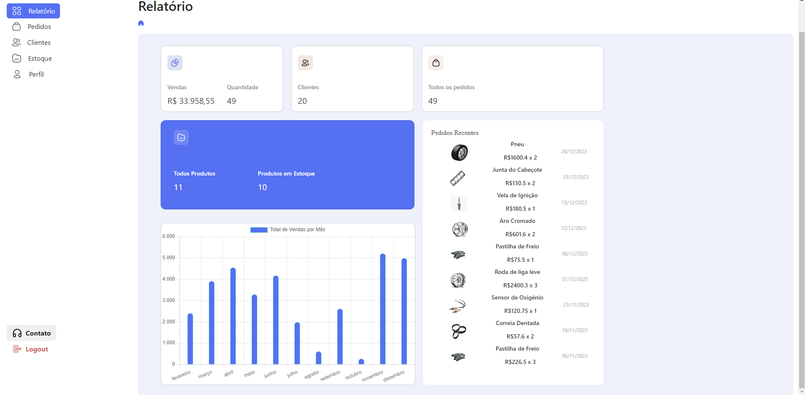

# Programação de Funcionalidades

### Dashboard

#### Requisito atendido

RF-03: Gerar relatórios das últimas movimentações, por período

#### Artefatos da funcionalidade

<li>dashboard.html</li>
<li>dashboard.css</li>
<li>dashboard.js</li>

#### Estrutura de Dados

<li>dashboard.html</li>

#### Instruções de acesso

Ao acessar a home do vendedor e do gerente, o usuario deverá apertar no menu lateral a esquerda em "Dashboard" para acessar a página.

#### Responsável

Gabriel Barboza da Gama Reis Silva

### Clientes

#### Requisito atendido

[RF-X: adicione a descrição do requisito atendido]

#### Artefatos da funcionalidade

<li>customers.html</li>
<li>customers.js</li>

#### Estrutura de Dados

<li>customers.html</li>

#### Instruções de acesso

[Adicione as orientações de acesso à funcionalidade]

#### Responsável

Heitor Flavio Silva Oliveira

### Meu estoque

#### Requisito atendido

RF-02: Buscar peças com critérios como nome, código, status (disponível, não disponível), dados de entrada

#### Artefatos da funcionalidade

<li>myStock.html</li>
<li>myStock.js</li>

#### Estrutura de Dados

<li>myStock.html</li>

#### Instruções de acesso

Ao acessar a home do vendedor e do gerente, o usuario deverá apertar no menu lateral a esquerda em "My Stock" para acessar a página.

#### Responsável

Ernane Henrique de Oliveira

### Tela de login

#### Requisito atendido

[RF-X: adicione a descrição do requisito atendido]

#### Artefatos da funcionalidade

<li>login.html</li>
<li>login.css</li>
<li>login.js</li>

#### Estrutura de Dados

<li>login.html</li>

#### Instruções de acesso

[Adicione as orientações de acesso à funcionalidade]

#### Responsável

Erycson Jose da Silva

### Tela de cadastro

#### Requisito atendido

[RF-X: adicione a descrição do requisito atendido]

#### Artefatos da funcionalidade

<li>signup.html</li>
<li>signup.css</li>
<li>signup.js</li>

#### Estrutura de Dados

<li>signup.html</li>

#### Instruções de acesso

[Adicione as orientações de acesso à funcionalidade]

#### Responsável

Erycson Jose da Silva

### Tela de Pedidos

"

#### Requisito atendido

[RF-X: adicione a descrição do requisito atendido]

#### Artefatos da funcionalidade

<li>orders.html</li>

#### Estrutura de Dados

<li>orders.html</li>

#### Instruções de acesso

[Adicione as orientações de acesso à funcionalidade]

#### Responsável
Pedro Henrique Pires de Souza Neves 

