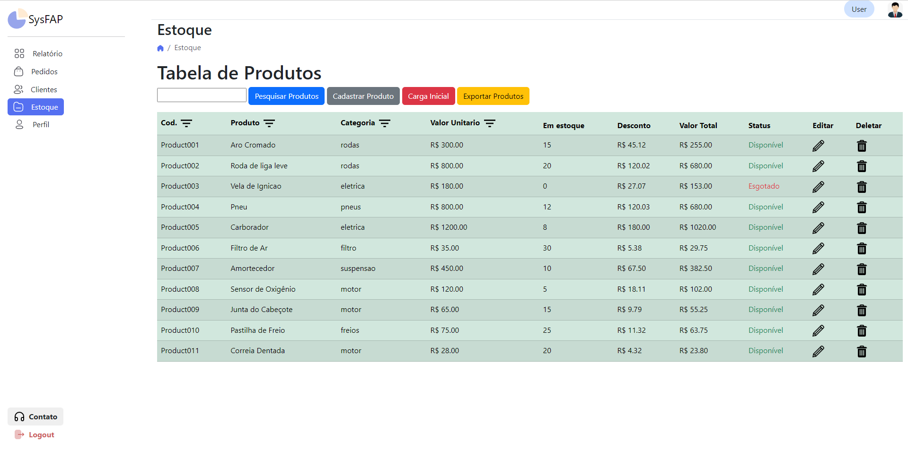
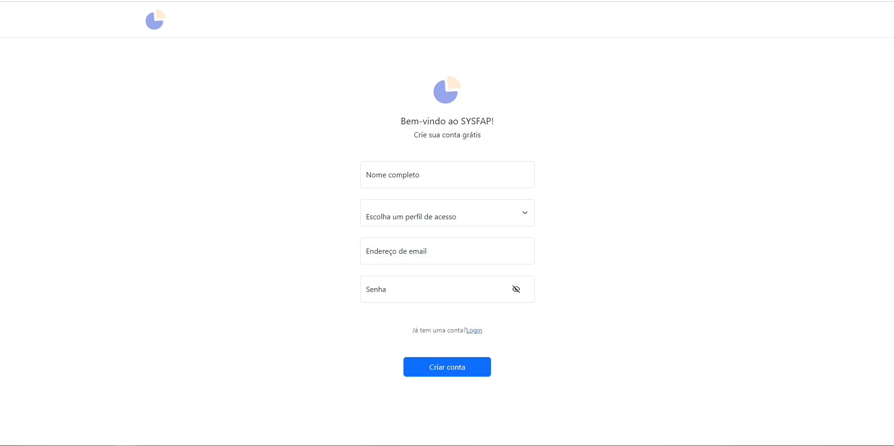

# Programação de Funcionalidades

### Painel de Controle

#### Requisito atendido

<li> RF-03: Gerar relatórios das últimas movimentações, por período;</li>
<li>RF-07: Fornecer ao usuário as informações dos produtos(preço, características, quantidade, descrição do produto);</li>
<li>RF-08: Ser capaz de realizar a contagem de mercadorias em estoque.</li>
<li>RF-09:	O sistema deve ter uma função para visualização do fluxo de mercadorias;</li>
<li>RF-11: O sistema deve permitir ao vendedor e ao gerente a visualização dos pedidos realizados;</li>
 <li>RF-12: Permitir que o vendedor e o gerente visualize as informações sobre os pedidos(preço, quantidade, quantidade de total de pedidos);</li>
 <li>RF-13:	Permitir que o vendedor e o gerente visualizem o valor total das vendas;</li>
 <li>RF-14: O site deve permitir ao vendedor e ao gerente visualizar um gráfico com o total de vendas por mês.</li>

#### Artefatos da funcionalidade

<li>dashboard.html</li>
<li>dashboard.css</li>
<li>dashboard.js</li>

#### Estrutura de Dados

<li>dashboard.html</li>

#### Instruções de acesso

Ao acessar a home do vendedor e do gerente, o usuario deverá apertar no menu lateral a esquerda em "Dashboard" para acessar a página.

#### Responsável

Gabriel Barboza da Gama Reis Silva

### Clientes

#### Requisito atendido

<li>RF-05:	Permitir que o gerente adicione, remova e atualize usuários</li>

#### Artefatos da funcionalidade

<li>customers.html</li>
<li>customers.js</li>

#### Estrutura de Dados

<li>customers.html</li>

#### Instruções de acesso

Ao acessar a home do vendedor e do gerente, o usuario deverá apertar no menu lateral a esquerda em "Customers" para acessar a página.

#### Responsável

Heitor Flavio Silva Oliveira

### Meu estoque

#### Requisito atendido

<li>RF-02: Buscar peças com critérios como nome, código, status (disponível, não disponível), dados de entrada</li>

#### Artefatos da funcionalidade

<li>myStock.html</li>
<li>myStock.js</li>

#### Estrutura de Dados

<li>myStock.html</li>

#### Instruções de acesso

Ao acessar a home do vendedor e do gerente, o usuario deverá apertar no menu lateral a esquerda em "My Stock" para acessar a página.

#### Responsável

Ernane Henrique de Oliveira

### Tela de login

#### Requisito atendido

<li>RF-10:	O sistema deve permitir ao usuario que possa realizar login no site</li>

#### Artefatos da funcionalidade

<li>login.html</li>
<li>login.css</li>
<li>login.js</li>

#### Estrutura de Dados

<li>login.html</li>

#### Instruções de acesso

Ao acessar o sistema o usuário é redirecionado automaticamente para a pagina de login do site

#### Responsável

Erycson Jose da Silva

### Tela de cadastro

#### Requisito atendido

<li>RF-10	O sistema deve permitir ao usuario que possa realizar cadastro e fazer login no site</li>

#### Artefatos da funcionalidade

<li>signup.html</li>
<li>signup.css</li>
<li>signup.js</li>

#### Estrutura de Dados

<li>signup.html</li>

#### Instruções de acesso

Caso o usuário não tenha um cadastro ativo no sistema, ele deverá clicar em "Signup" na tela de login, assim ele será redirecionado a uma pagina em que ele poderá realizar o seu cadastro no site

#### Responsável

Erycson Jose da Silva

### Pagina de Pedidos

"

#### Requisito atendido

<li>RF-11:	O sistema deve permitir ao vendedor e ao gerente a visualização dos pedidos realizados</li>

#### Artefatos da funcionalidade

<li>orders.html</li>

#### Estrutura de Dados

<li>orders.html</li>

#### Instruções de acesso

Ao acessar a home do vendedor e do gerente, o usuario deverá apertar no menu lateral a esquerda em "Orders" para acessar a página.

#### Responsável
Pedro Henrique Pires de Souza Neves 

### Home do cliente

#### Requisito atendido

<li>RF-10	O sistema deve permitir ao usuario que possa realizar cadastro e fazer login no site</li>

#### Artefatos da funcionalidade

<li>signup.html</li>
<li>signup.css</li>
<li>signup.js</li>

#### Estrutura de Dados

<li>signup.html</li>

#### Instruções de acesso

Caso o usuário não tenha um cadastro ativo no sistema, ele deverá clicar em "Signup" na tela de login, assim ele será redirecionado a uma pagina em que ele poderá realizar o seu cadastro no site

#### Responsável

Erycson Jose da Silva