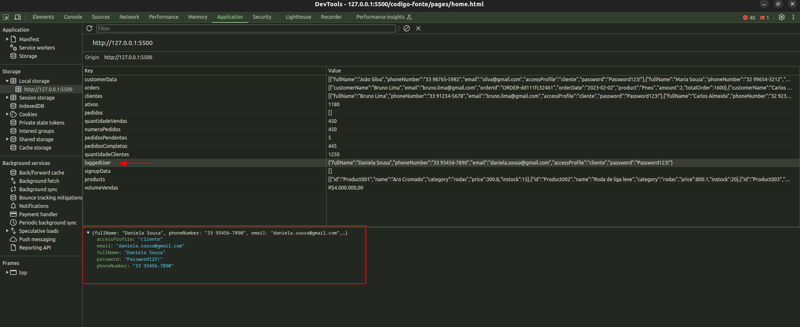

# Registro de Testes de Software

Pré-requisitos: <a href="https://github.com/ICEI-PUC-Minas-PMV-ADS/pmv-ads-2024-1-e1-proj-web-t5-pmv-ads-2024-1-e1-projsysfap/blob/main/documentos/04-Projeto%20de%20Interface.md"> Projeto de Interface</a>, <a href="https://github.com/ICEI-PUC-Minas-PMV-ADS/pmv-ads-2024-1-e1-proj-web-t5-pmv-ads-2024-1-e1-projsysfap/blob/main/documentos/07-Plano%20de%20Testes%20de%20Software.md"> Plano de Testes de Software</a>

Os testes funcionais realizados na aplicação web são descritos a seguir.

<ol>
  <li> CT-01: Verificar a Atualização de Quantidade de Produtos

  Responsável: Gabriel.

  
No teste em questão foi verificado se a função responsável por calcular a quantidade de total e a quantidade de produtos ativos estava funcionando corretamente, logo em seguida foi feita a verificação da função "atualizarElemento" responsável por atualizar os elementos correspondentes no HTML.

  </li>
  

  
  <li> CT-02: Verificação da atualização da quantidade de vendas e de pedidos.

  Responsável: Gabriel.
    
  
No teste em questão foi verificado se a função responsável por calcular a quantidade de vendas e de pedidos estava funcionando corretamente, logo em seguida foi feita a verificação da função "atualizarElemento" responsável por atualizar os elementos correspondentes no HTML.

    

  </li>
  

  
  <li> CT-03: Verifica a atualização do valor total de vendas e se os valores estão sendo exibidos em R$.

Responsável: Gabriel.

  
No teste em questão foi verificado o funcionamento da função responsavel por calcular o valor total das vendas, em seguida se a variavel formattedTotalVendas estava retornando o valor formatado corretamente para "R$" e finalmente após isso foi feita a verificação da função "atualizarElemento" responsável por atualizar os elementos correspondentes no HTML. 

  </li>
  

  
  <li> CT-04:  Verificar a Visualização de Pedidos Recentes
   
  Responsável: Gabriel. 
   
   
No teste em questão foi checado através do console, o console.log responsável por informar os pedidos recentes, logo em seguida se todos os pedidos estavam com os icones correspondentes corretos

  
  

  </li>
  

  <li> CT-05: Verificar se o gráfico exibe os valores corretos de vendas por mês.

  Responsável: Gabriel
  
   
No teste em questão é checado através do console, o console.log responsável por informar a quantidade de vendas por mês, logo em seguida podemos visualizar no gráfico se os valores correspondem ao valor informado no LOG. 

  
  
  

  </li>  
  

  <li> CT-06: Verificar login do usuário.

  Responsável: Erycson José.

  
Ao acessar a página de login o usuário deve preencher os campos "Endereço de email" e "Senha" com valores já cadastrados, caso contrário o acesso ao sistema não será possível. Quando as informações fornecidas pelo usuaŕio forem válidas, o login será bem sucessido e as informações serão armazenadas no localstorage indicando que o usuários está logado

  </li>
  

  <li> CT-07: Verificar cadastro de usuário.

  Responsável: Erycson José.

  
Ao acessar a página de cadastro o usuário deve preencher os todos os campos corretamente, caso contrário o cadastros e o acesso ao sistema não será possível. Para que o cadastro seja válido o usuário deve preencher o campo "nome completo" com no minimo 4 caracters, selecionar um perfil de acesso, preencher o campo "email" com um email válido e que não esteja já cadastrado, preencher o campo "número de celular" com um valor válido e criar uma senha que contenha no mínimo 8 caracteres, entre eles 1 letra minúscula, 1 letra maiúscula, 1 número e 1 caractere especial. Quando as informações fornecidas pelo usuaŕio forem válidas, o cadastro será bem sucessido e as informações serão armazenadas no localstorage

  </li>
  

  <li> CT-08: Verificar a página de pedidos.

  Responsável: Erycson José.

  
Ao acessar a página de pedidos o usuário deve de visualizar todos os pedidos realizados, verificando as seguintes informações, id do pedido, nome do cliente, data do pedido e valor do pedido

  </li>
  

  <li> CT-09: Verificar a página do cliente.

  Responsável: Erycson José.

  
Ao acessar a página de dashborad do cliente o usuário deve visualizar os produtos cadastrados no sistema, adicionar o produto ao carrinho e clicar no botão comprar para realizar pedido, assim que o pedido for concluido com sucesso a tabela de pedidos será atualizada

  </li>
  
  </ol>
    

## Avaliação

Os testes de software mostraram que os requisitos priorizados foram atendidos, funcionando como planejado. Para as próximas iterações, serão acrescentadas melhorias no layout e responsividade da aplicação. 